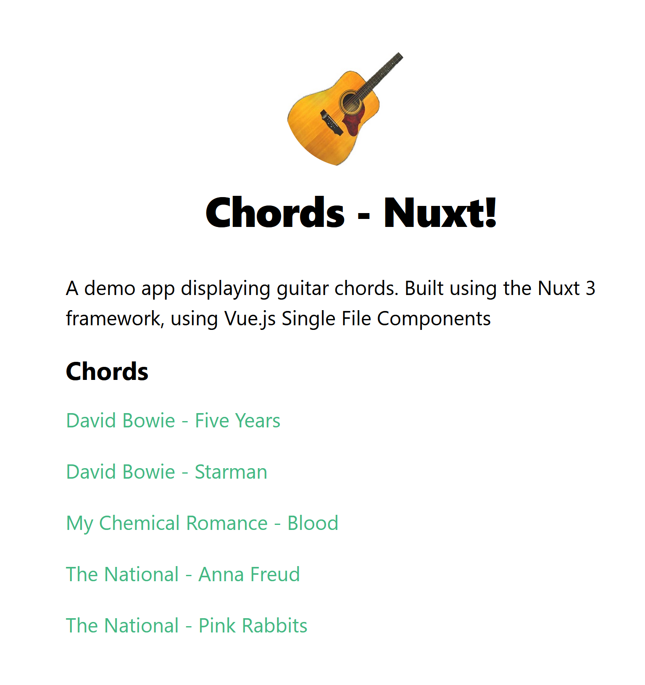

# Chords - Nuxt

A portfolio project displaying guitar chords with finger-positions on-hover. Part of my Chords project - building the same site in different frameworks/with different tools.

This edition is built using [Vue](https://vuejs.org/) and [Nuxt3](https://v3.nuxtjs.org/) web framework.

Making use of:

- VueJS Single File Components
- A lightweight frontend with pages hydrated with data from serverless functions deployed to Netlify (as part of the [Chords - Svelte](https://github.com/emilkloeden/chords-svelte/) build).
- A scoped npm package to parse chord data from files [@emilkloeden/chordify](https://www.npmjs.com/package/@emilkloeden/chordify)
- Deployed to Vercel

## See it in action

Visit [Chords - Nuxt](https://chords-nuxt.vercel.app/) on Vercel.
